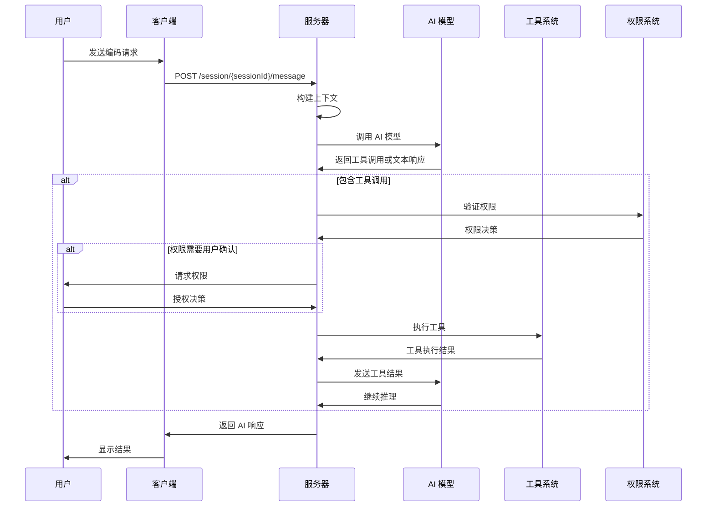
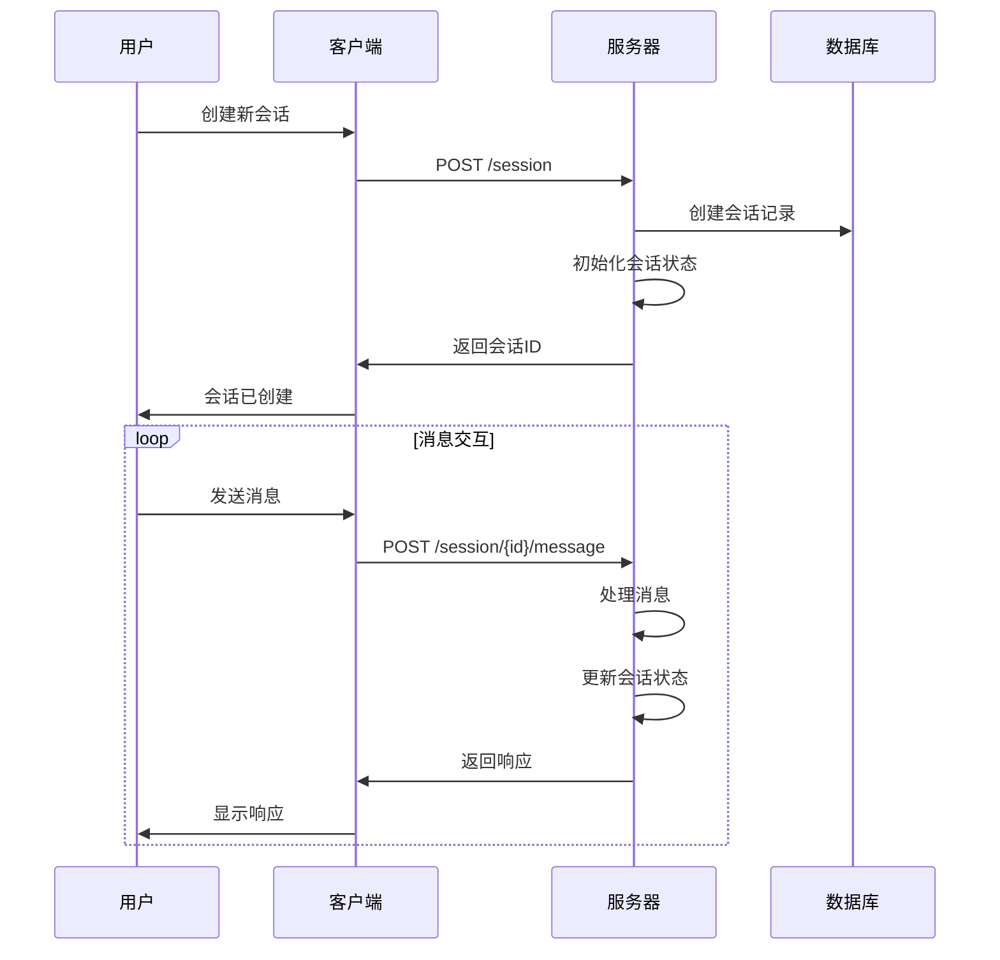
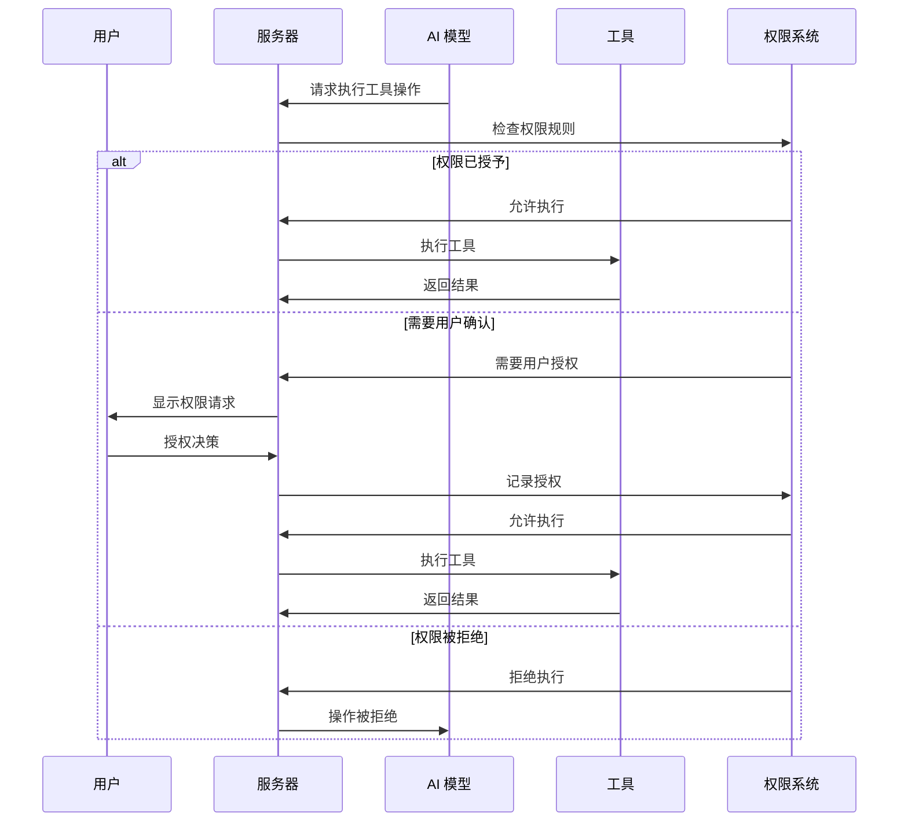

# OpenCode AI 编码助手技术实现剖析文档

## 1. 项目概述

OpenCode 是一个开源的 AI 编码助手，通过工具驱动的方式实现智能化编程辅助。系统采用客户端-服务器架构，支持多种 AI 提供商，具有完善的安全机制和权限控制系统。

## 2. 核心架构

### 2.1 系统架构图

```
┌─────────────────┐    ┌─────────────────┐    ┌─────────────────┐
│   客户端        │    │   服务器        │    │   AI 提供商     │
│  (CLI/TUI/Web)  │◄──►│  (Hono Server)  │◄──►│  (Anthropic/    │
└─────────────────┘    └─────────────────┘    │   OpenAI/etc.)  │
                                              └─────────────────┘
                                                      ▲
                                                      │
                                              ┌─────────────────┐
                                              │   工具系统      │
                                              │  (bash/read/   │
                                              │   write/edit)   │
                                              └─────────────────┘
```

### 2.2 技术栈
- **运行时**: Bun.js
- **Web 框架**: Hono
- **前端**: SolidJS
- **类型系统**: TypeScript + Zod
- **命令行**: Yargs
- **AI SDK**: Vercel AI SDK

## 3. 核心节点分析

### 3.1 输入节点
- **用户消息节点**: 接收用户输入
- **文件附件节点**: 处理文件上传和附件
- **会话参数节点**: 处理会话配置参数

### 3.2 上下文构建节点
- **项目信息节点**: 获取项目结构和配置
- **文件上下文节点**: 提取相关文件内容
- **历史消息节点**: 整理会话历史
- **系统提示节点**: 构建 AI 系统提示词

### 3.3 AI 决策节点
- **模型选择节点**: 根据配置选择 AI 模型
- **推理节点**: 执行 AI 推理
- **工具解析节点**: 解析 AI 的工具调用请求

### 3.4 权限控制节点
- **权限验证节点**: 检查操作权限
- **用户授权节点**: 请求用户授权
- **权限记录节点**: 记录授权决策

### 3.5 工具执行节点
- **Bash 执行节点**: 执行 shell 命令
- **文件操作节点**: 读写编辑文件
- **搜索节点**: 文件搜索和过滤
- **网络节点**: 网络请求和搜索

### 3.6 状态管理节点
- **会话状态节点**: 管理会话状态
- **消息历史节点**: 维护对话历史
- **错误处理节点**: 处理异常情况

## 4. 核心流程分析

### 4.1 AI 编码主流程



### 4.2 会话管理流程



### 4.3 权限控制流程



## 5. API 接口设计

### 5.1 会话管理接口

```typescript
// 创建会话
POST /session
Request: { title?: string, permission?: PermissionRule[] }
Response: Session.Info

// 发送消息
POST /session/:sessionID/message
Request: { parts: MessagePart[], agent?: string, model?: ModelInfo }
Response: { info: MessageV2.Assistant, parts: MessageV2.Part[] }

// 获取消息
GET /session/:sessionID/message
Response: MessageV2.WithParts[]
```

### 5.2 权限管理接口

```typescript
// 请求权限
POST /permission/:requestID/reply
Request: { reply: "once" | "always" | "reject", message?: string }
Response: boolean

// 获取待处理权限
GET /permission
Response: PermissionNext.Request[]
```

### 5.3 事件订阅接口

```typescript
// 订阅事件
GET /event
Response: SSE 流
Events: {
  "message.part.updated": { part: MessagePart },
  "session.error": { sessionID: string, error: Error },
  "permission.asked": { permission: PermissionRequest }
}
```

## 6. 核心模块实现

### 6.1 会话管理模块

```typescript
namespace Session {
  // 会话创建
  async function create(config: CreateConfig): Promise<Session.Info>
  
  // 消息处理
  async function messages(params: { sessionID: string, limit?: number }): Promise<MessageV2.WithParts[]>
  
  // 会话分叉
  async function fork(params: ForkParams): Promise<Session.Info>
  
  // 会话共享
  async function share(sessionID: string): Promise<void>
}
```

### 6.2 工具系统模块

```typescript
namespace Tool {
  // 工具定义
  function define<Parameters, Metadata>(
    id: string,
    init: ToolInitializer<Parameters, Metadata>
  ): Info<Parameters, Metadata>
  
  // Bash 工具实现
  const BashTool = Tool.define("bash", () => ({
    description: "执行 shell 命令",
    parameters: z.object({
      command: z.string(),
      timeout: z.number().optional()
    }),
    async execute(params, ctx) {
      // 权限检查
      // 命令执行
      // 结果返回
    }
  }))
}
```

### 6.3 权限控制系统

```typescript
namespace PermissionNext {
  // 权限请求
  async function ask(request: PermissionRequest): Promise<void>
  
  // 权限响应
  async function reply(response: PermissionResponse): Promise<void>
  
  // 权限评估
  function evaluate(permission: string, pattern: string, ...rulesets: Ruleset[]): Rule
}
```

## 7. 安全机制

### 7.1 权限层次
- **系统级**: 防止恶意系统操作
- **文件级**: 控制文件访问权限
- **网络级**: 限制网络请求
- **工具级**: 精细的工具使用控制

### 7.2 安全检查流程
1. 工具调用前的安全检查
2. 权限规则匹配
3. 用户授权确认
4. 操作执行监控
5. 结果验证

## 8. 扩展机制

### 8.1 插件系统
- 自定义工具开发
- 新 AI 提供商集成
- 功能扩展

### 8.2 协议支持
- MCP (Model Context Protocol)
- ACP (Agent Communication Protocol)

## 9. 性能优化

### 9.1 缓存机制
- 会话状态缓存
- 工具执行结果缓存
- AI 模型响应缓存

### 9.2 并发处理
- 异步工具执行
- 流式响应处理
- 并行请求处理

## 10. 总结

OpenCode 通过精心设计的架构和流程，实现了安全、可控、高效的 AI 编码辅助功能。其核心优势在于：

1. **安全性**: 通过权限系统确保 AI 操作的安全性
2. **可控性**: 用户可以随时干预和控制 AI 行为
3. **扩展性**: 模块化设计便于功能扩展
4. **易用性**: 统一的 API 和多种客户端界面
5. **智能性**: 基于工具的 AI 推理实现复杂任务

这套系统为 AI 辅助编程提供了一个完整、可靠的技术解决方案。