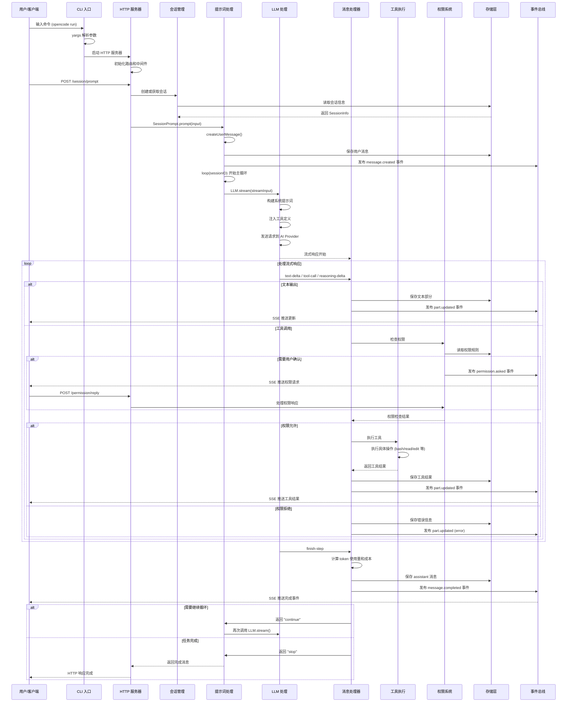

# OpenCode 实现原理

> 本文档详细解析 OpenCode 系统的核心处理流程、函数交互时序和关键实现细节。

## 目录

- [一、用户会话处理完整流程](#一用户会话处理完整流程)
- [二、系统函数交互时序图](#二系统函数交互时序图)
- [三、核心流程详解](#三核心流程详解)
- [四、关键实现细节](#四关键实现细节)

---

## 一、用户会话处理完整流程

### 1.1 处理流程概览

当用户在 OpenCode 中输入请求后，系统经历以下处理阶段：

```
用户输入 → CLI 解析 → 服务器路由 → 会话管理 → AI 处理 → 工具执行 → 结果返回
```

**核心处理阶段**：

1. **入口与初始化** - CLI 命令解析、日志初始化
2. **服务器启动与请求接收** - HTTP 服务器、REST API、SSE 事件流
3. **会话创建与管理** - 创建会话、生成 sessionID、发布事件
4. **用户消息处理** - 提示词处理、创建用户消息、解析消息部分
5. **AI 模型交互** - LLM 流式处理、构建系统提示词、注入工具定义
6. **响应处理** - 消息处理器、处理流式响应
7. **工具执行** - 工具注册表、权限检查、执行工具
8. **结果存储与广播** - 消息存储、事件广播（SSE 推送）

### 1.2 详细处理步骤

#### 步骤 1: 入口与初始化

**入口点**: `packages/opencode/src/index.ts`

```typescript
// 1. 解析命令行参数
const cli = yargs(hideBin(process.argv))
  .command(RunCommand) // opencode run
  .command(TuiThreadCommand) // opencode (交互模式)

// 2. 初始化日志系统
await Log.init({
  print: process.argv.includes("--print-logs"),
  level: "INFO",
})

// 3. 执行命令
await cli.parse()
```

**代码位置**: `packages/opencode/src/index.ts:42-115`

---

#### 步骤 2: 服务器启动

**HTTP 服务器**: `packages/opencode/src/server/server.ts`

```typescript
export function listen(opts: { port: number; hostname: string }) {
  const server = Bun.serve({
    hostname: opts.hostname,
    port: opts.port,
    fetch: App().fetch,
    websocket: websocket,
  })
  return server
}
```

**路由注册**:

```typescript
app
  .route("/session", SessionRoutes()) // 会话管理
  .route("/file", FileRoutes()) // 文件操作
  .route("/mcp", McpRoutes()) // MCP 集成
  .get("/event", eventStreamHandler) // SSE 事件流
```

**代码位置**: `packages/opencode/src/server/server.ts:566-606`

---

#### 步骤 3: 接收用户提示词

**API 端点**: `POST /session/prompt`

**路由处理**: `packages/opencode/src/server/routes/session.ts`

```typescript
.post("/prompt", async (c) => {
  const input = c.req.valid("json")
  const result = await SessionPrompt.prompt({
    sessionID: input.sessionID,
    parts: input.parts,
    model: input.model,
    agent: input.agent
  })
  return c.json(result)
})
```

---

#### 步骤 4: 创建用户消息

**提示词处理**: `packages/opencode/src/session/prompt.ts`

```typescript
export const prompt = fn(PromptInput, async (input) => {
  // 1. 获取会话信息
  const session = await Session.get(input.sessionID)

  // 2. 创建用户消息
  const message = await createUserMessage(input)

  // 3. 更新会话时间戳
  await Session.touch(input.sessionID)

  // 4. 进入主循环
  return loop(input.sessionID)
})

async function createUserMessage(input: PromptInput) {
  const messageID = Identifier.ascending("message")
  const message: MessageV2.User = {
    id: messageID,
    sessionID: input.sessionID,
    role: "user",
    time: { created: Date.now() },
  }

  // 保存用户消息
  await Session.updateMessage(message)

  // 保存消息部分（文本、文件等）
  for (const part of input.parts) {
    await Session.updatePart({
      ...part,
      id: Identifier.ascending("part"),
      messageID,
      sessionID: input.sessionID,
    })
  }

  return message
}
```

**代码位置**: `packages/opencode/src/session/prompt.ts:152-181`

---

#### 步骤 5: 主处理循环

```typescript
async function loop(sessionID: string) {
  while (true) {
    // 1. 创建 assistant 消息
    const assistantMessage = await Session.updateMessage({
      id: Identifier.ascending("message"),
      sessionID,
      role: "assistant",
      agent: agentName,
      model: { providerID, modelID },
      parentID: lastUserMessage.id,
      time: { created: Date.now() },
      cost: 0,
      tokens: { input: 0, output: 0, reasoning: 0, cache: { read: 0, write: 0 } },
    })

    // 2. 构建 LLM 输入
    const streamInput = await buildStreamInput(sessionID, assistantMessage)

    // 3. 创建消息处理器
    const processor = SessionProcessor.create({
      assistantMessage,
      sessionID,
      model,
      abort: abortController.signal,
    })

    // 4. 处理流式响应
    const result = await processor.process(streamInput)

    // 5. 根据结果决定是否继续
    if (result === "stop") break
    if (result === "compact") {
      await SessionCompaction.summarize(sessionID)
      continue
    }
    // result === "continue" 继续循环
  }

  return assistantMessage
}
```

**代码位置**: `packages/opencode/src/session/prompt.ts:800-950` (简化)

---

#### 步骤 6: 构建 LLM 输入

```typescript
async function buildStreamInput(sessionID: string, assistantMessage: MessageV2.Assistant) {
  // 1. 构建系统提示词
  const systemPrompt = await SystemPrompt.build()

  // 2. 获取历史消息
  const history = await MessageV2.history(sessionID)

  // 3. 转换为 AI SDK 格式
  const messages = convertToAIMessages(history)

  // 4. 注册工具
  const tools = await ToolRegistry.build()

  return {
    model,
    system: systemPrompt,
    messages,
    tools,
    maxSteps: 100,
  }
}
```

**系统提示词结构**:

```typescript
const systemPrompt = `
You are OpenCode, an interactive CLI tool that helps users with software engineering tasks.

# Professional objectivity
Prioritize technical accuracy and truthfulness...

# Tool usage policy
- Use specialized tools instead of bash commands when possible...

# Current environment
Working directory: ${cwd}
Platform: ${platform}
Today's date: ${date}

${agentInstructions}
${projectInstructions}
`
```

**代码位置**: `packages/opencode/src/session/system.ts`

---

#### 步骤 7: 发送请求到 AI 模型

**LLM 交互**: `packages/opencode/src/session/llm.ts`

```typescript
export async function stream(input: StreamInput) {
  const result = await streamText({
    model: input.model,
    system: input.system,
    messages: input.messages,
    tools: input.tools,
    maxSteps: input.maxSteps,
    maxTokens: OUTPUT_TOKEN_MAX,
    temperature: 0.7,
    onStepFinish: input.onStepFinish,
  })

  return result
}
```

**AI SDK 调用流程**:

```
LLM.stream()
  → AI SDK streamText()
  → Provider API (OpenAI/Anthropic/...)
  → 流式响应返回
```

**代码位置**: `packages/opencode/src/session/llm.ts:50-180`

---

#### 步骤 8: 处理流式响应

**消息处理器**: `packages/opencode/src/session/processor.ts`

```typescript
export function create(input: {
  assistantMessage: MessageV2.Assistant
  sessionID: string
  model: Provider.Model
  abort: AbortSignal
}) {
  const toolcalls: Record<string, MessageV2.ToolPart> = {}

  return {
    async process(streamInput: LLM.StreamInput) {
      const stream = await LLM.stream(streamInput)

      for await (const value of stream.fullStream) {
        switch (value.type) {
          case "text-delta":
            // 处理文本增量输出
            await handleTextDelta(value)
            break

          case "tool-call":
            // 处理工具调用
            await handleToolCall(value)
            break

          case "tool-result":
            // 处理工具结果
            await handleToolResult(value)
            break

          case "reasoning-delta":
            // 处理推理过程
            await handleReasoningDelta(value)
            break

          case "finish-step":
            // 处理步骤完成
            await handleStepFinish(value)
            break
        }
      }

      // 返回下一步动作：continue / stop / compact
      return determineNextAction()
    },
  }
}
```

**代码位置**: `packages/opencode/src/session/processor.ts:26-414`

---

#### 步骤 9: 工具执行

**工具调用流程**:

```typescript
// 1. 接收工具调用请求
case "tool-call": {
  const toolPart = toolcalls[value.toolCallId]

  // 2. 更新工具状态为 "running"
  await Session.updatePart({
    ...toolPart,
    state: { status: "running", input: value.input }
  })

  // 3. 检查权限
  await PermissionNext.ask({
    permission: value.toolName,
    sessionID,
    metadata: value.input
  })

  // 4. 执行工具（由 AI SDK 自动处理）
}

// 5. 接收工具结果
case "tool-result": {
  await Session.updatePart({
    ...toolPart,
    state: {
      status: "completed",
      output: value.output.output,
      metadata: value.output.metadata
    }
  })
}
```

---

#### 步骤 10: 权限控制

**权限检查**: `packages/opencode/src/permission/next.ts`

```typescript
export async function ask(input: {
  permission: string
  patterns: string[]
  sessionID: string
  metadata?: Record<string, any>
  ruleset?: Ruleset
}) {
  // 1. 获取会话的权限规则
  const session = await Session.get(input.sessionID)
  const ruleset = input.ruleset ?? session.permission ?? []

  // 2. 检查规则
  for (const rule of ruleset) {
    if (rule.permission !== input.permission) continue

    const matched = input.patterns.some((pattern) => minimatch(pattern, rule.pattern))

    if (!matched) continue

    // 3. 根据规则动作处理
    if (rule.action === "allow") {
      return // 允许执行
    }

    if (rule.action === "deny") {
      throw new RejectedError("Permission denied")
    }

    if (rule.action === "ask") {
      // 4. 询问用户
      const permissionID = ulid()

      // 发布权限请求事件
      Bus.publish(Permission.Event.Asked, {
        id: permissionID,
        sessionID: input.sessionID,
        permission: input.permission,
        metadata: input.metadata,
      })

      // 等待用户响应
      const reply = await waitForReply(permissionID)

      if (reply === "reject") {
        throw new RejectedError("Permission denied by user")
      }

      return // 用户允许
    }
  }

  // 5. 默认行为：询问用户
}
```

**代码位置**: `packages/opencode/src/permission/next.ts:100-250`

---

#### 步骤 11: 事件广播

**事件总线**: `packages/opencode/src/bus/index.ts`

```typescript
// 发布事件
Bus.publish(MessageV2.Event.PartUpdated, {
  part: textPart,
  delta: "新增的文本",
})

// SSE 推送到客户端
app.get("/event", async (c) => {
  return streamSSE(c, async (stream) => {
    const unsub = Bus.subscribeAll(async (event) => {
      await stream.writeSSE({
        data: JSON.stringify(event),
      })
    })
  })
})
```

**事件流向**:

```
处理器更新数据
  ↓
发布事件到 Bus
  ↓
Bus 通知所有订阅者
  ↓
SSE 推送到客户端
  ↓
客户端更新 UI
```

**代码位置**:

- 事件总线：`packages/opencode/src/bus/index.ts`
- SSE 端点：`packages/opencode/src/server/server.ts:478-531`

---

#### 步骤 12: 循环判断

```typescript
async function loop(sessionID: string) {
  while (true) {
    // ... 处理流程

    const result = await processor.process(streamInput)

    if (result === "stop") {
      // 停止循环：出错或用户拒绝权限
      break
    }

    if (result === "compact") {
      // 上下文过长，需要压缩
      await SessionCompaction.summarize(sessionID)
      continue // 继续下一轮
    }

    // result === "continue"
    // AI 需要继续执行更多步骤
    continue
  }

  return assistantMessage
}
```

**上下文压缩**: `packages/opencode/src/session/compaction.ts`

```typescript
export async function summarize(sessionID: string) {
  // 1. 获取需要压缩的消息
  const messages = await Session.messages({ sessionID })

  // 2. 使用 AI 生成摘要
  const summary = await generateSummary(messages)

  // 3. 替换旧消息为摘要
  await replaceWithSummary(sessionID, summary)

  // 4. 更新会话压缩时间
  await Session.update(sessionID, (draft) => {
    draft.time.compacting = Date.now()
  })
}
```

---

## 二、系统函数交互时序图



---

## 三、核心流程详解

### 3.1 会话创建流程

```
客户端                          服务器
  │                              │
  ├── POST /session ───────────> │
  │                              │ 创建 Session.Info
  │                              │ 保存到存储
  │                              │ 发布 session.created 事件
  │ <───── Session.Info ──────── │
  │                              │
  ├── GET /event ──────────────> │ (SSE 连接)
  │ <──── server.connected ───── │
  │ <──── session.created ────── │
```

### 3.2 权限请求流程

```
客户端                          服务器
  │                              │
  │ <──── permission.asked ───── │ (SSE 推送)
  │                              │   { id, permission, metadata }
  │                              │
  ├── GET /permission ─────────> │ (获取待处理权限)
  │ <──── Permission[] ───────── │
  │                              │
  ├── POST /permission/:id/reply ─> │
  │   { reply: "once" }            │ 更新权限状态
  │                              │ 恢复等待的 Promise
  │ <──── true ───────────────── │
  │                              │ 继续工具执行
```

**权限检查代码位置**: `packages/opencode/src/permission/next.ts:100-250`

### 3.3 工具执行流程

```
AI 模型                         服务器                          客户端
  │                              │                              │
  │ ── tool-call ──────────────> │                              │
  │                              │ 更新 tool state 为 running    │
  │                              │ 发布 message.part.updated    │
  │                              │                              │ <─ part.updated
  │                              │ 检查权限                     │
  │                              │ (PermissionNext.ask)         │
  │                              │                              │
  │                              ├─ 允许 ──> 执行工具           │
  │                              │                              │
  │ <─ tool-result ─────────────│                              │
  │                              │ 更新 tool state 为 completed │
  │                              │ 发布 message.part.updated    │
  │                              │                              │ <─ part.updated
  │                              │                              │
```

### 3.4 SSE 事件推送流程

```typescript
// 服务器端实现
// packages/opencode/src/server/server.ts:478-531
app.get("/event", async (c) => {
  return streamSSE(c, async (stream) => {
    // 发送连接事件
    stream.writeSSE({
      data: JSON.stringify({ type: "server.connected" }),
    })

    // 订阅所有 Bus 事件
    const unsub = Bus.subscribeAll(async (event) => {
      await stream.writeSSE({
        data: JSON.stringify(event),
      })

      if (event.type === "global.disposed") {
        stream.close()
      }
    })

    // 心跳
    const heartbeat = setInterval(() => {
      stream.writeSSE({
        data: JSON.stringify({ type: "server.heartbeat" }),
      })
    }, 30000)

    // 清理
    stream.onAbort(() => {
      clearInterval(heartbeat)
      unsub()
    })
  })
})
```

---

## 四、关键实现细节

### 4.1 流式响应处理

使用 Vercel AI SDK 的 `streamText()` API:

```typescript
// packages/opencode/src/session/llm.ts
export async function stream(input: StreamInput) {
  const result = await streamText({
    model: input.model,
    system: input.system,
    messages: input.messages,
    tools: input.tools,
    maxSteps: input.maxSteps,
    maxTokens: OUTPUT_TOKEN_MAX,
    temperature: 0.7,
    onStepFinish: input.onStepFinish,
  })

  return result
}
```

**代码位置**: `packages/opencode/src/session/llm.ts:50-180`

### 4.2 消息部分更新处理

```typescript
// 处理器中处理文本增量
case "text-delta": {
  currentText.text += value.text

  // 保存并推送
  await Session.updatePart({
    part: currentText,
    delta: value.text  // 客户端可用 delta 增量更新 UI
  })

  break
}
```

### 4.3 权限 Deferred Promise 机制

```typescript
// packages/opencode/src/permission/next.ts
const pendingPermissions = new Map<string, Deferred<"allow" | "deny">>()

async function askUser(input: { permission: string; sessionID: string; metadata?: Record<string, any> }) {
  const permissionID = ulid()

  // 创建 Deferred Promise
  const deferred = defer<"allow" | "deny">()
  pendingPermissions.set(permissionID, deferred)

  // 发布事件
  Bus.publish(Permission.Event.Asked, {
    id: permissionID,
    sessionID: input.sessionID,
    permission: input.permission,
    metadata: input.metadata,
  })

  // 等待用户响应（超时 5 分钟）
  const reply = await Promise.race([deferred.promise, sleep(300000).then(() => "deny" as const)])

  pendingPermissions.delete(permissionID)

  if (reply === "deny") {
    throw new RejectedError("Permission denied by user")
  }

  return
}

// 处理用户响应
export async function reply(input: { requestID: string; reply: "once" | "always" | "reject" }) {
  const deferred = pendingPermissions.get(input.requestID)

  if (!deferred) {
    throw new Error("Permission request not found")
  }

  if (input.reply === "reject") {
    deferred.resolve("deny")
  } else {
    deferred.resolve("allow")

    if (input.reply === "always") {
      await updateRuleset(input.requestID, "allow")
    }
  }
}
```

### 4.4 上下文压缩策略

当会话上下文超过阈值时触发压缩：

```typescript
// packages/opencode/src/session/compaction.ts
export async function summarize(sessionID: string) {
  // 1. 获取需要压缩的消息
  const messages = await Session.messages({ sessionID })

  // 2. 使用 AI 生成摘要
  const summary = await generateSummary(messages)

  // 3. 替换旧消息为摘要
  await replaceWithSummary(sessionID, summary)

  // 4. 更新会话压缩时间
  await Session.update(sessionID, (draft) => {
    draft.time.compacting = Date.now()
  })
}
```

**压缩触发条件**:

- Token 数量超过模型限制
- 消息数量超过阈值
- 用户手动触发

---

## 附录

### A. 代码位置索引

| 功能            | 文件路径                                         |
| --------------- | ------------------------------------------------ |
| **CLI 入口**    | `packages/opencode/src/index.ts`                 |
| **HTTP 服务器** | `packages/opencode/src/server/server.ts`         |
| **会话路由**    | `packages/opencode/src/server/routes/session.ts` |
| **提示词处理**  | `packages/opencode/src/session/prompt.ts`        |
| **消息处理器**  | `packages/opencode/src/session/processor.ts`     |
| **LLM 流**      | `packages/opencode/src/session/llm.ts`           |
| **权限控制**    | `packages/opencode/src/permission/next.ts`       |
| **事件总线**    | `packages/opencode/src/bus/index.ts`             |
| **工具注册表**  | `packages/opencode/src/tool/registry.ts`         |

### B. 相关文档

- [系统架构](./系统架构.md) - 整体架构和模块设计
- [API 参考](./API 参考.md) - HTTP API 和 SSE 事件

### C. 更新日志

本文档最后更新：2026-03-01  
对应 OpenCode 版本：基于 dev 分支
