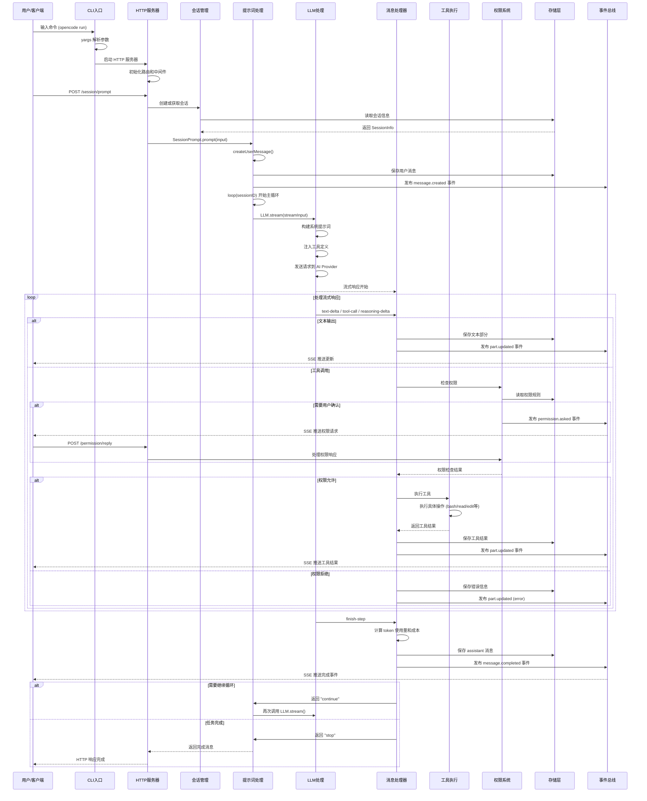

# OpenCode 系统架构与源码实现原理文档

> 本文档详细介绍 OpenCode 项目的系统架构、数据流向、函数交互时序和核心实现原理。

---

## 目录

- [一、系统概述](#一系统概述)
- [二、整体架构](#二整体架构)
- [三、用户会话处理完整流程](#三用户会话处理完整流程)
- [四、系统函数交互时序图](#四系统函数交互时序图)
- [五、核心模块详解](#五核心模块详解)
- [六、数据存储与事件系统](#六数据存储与事件系统)
- [七、关键技术实现](#七关键技术实现)
- [八、代码路径索引](#八代码路径索引)

---

## 一、系统概述

OpenCode 是一个开源的 AI 编码代理系统，采用客户端-服务器架构设计，支持多种 AI 模型和工具集成。

### 核心特性

- **多模型支持**: 集成 20+ AI 提供商（Anthropic、OpenAI、Google 等）
- **工具丰富**: 内置文件操作、命令执行、代码搜索等 24+ 工具
- **权限控制**: 细粒度的安全权限系统
- **流式响应**: 实时增量输出，提供即时反馈
- **会话管理**: 支持会话分叉、快照、回滚等功能
- **协议支持**: 实现 ACP（Agent Client Protocol）和 MCP（Model Context Protocol）

### 技术栈

- **运行时**: Bun (JavaScript/TypeScript)
- **Web框架**: Hono
- **AI SDK**: Vercel AI SDK
- **数据库**: 文件系统 JSON 存储
- **协议**: HTTP REST API + Server-Sent Events (SSE)

---

## 二、整体架构

### 2.1 分层架构图

```
┌─────────────────────────────────────────────────────────────────┐
│                          客户端层                                 │
│  ┌──────────┐  ┌──────────┐  ┌──────────┐  ┌──────────────┐   │
│  │ CLI终端  │  │ 桌面应用  │  │ Web界面  │  │ ACP客户端    │   │
│  └──────────┘  └──────────┘  └──────────┘  └──────────────┘   │
└────────────────────────┬────────────────────────────────────────┘
                         │
┌────────────────────────▼────────────────────────────────────────┐
│                          入口层                                   │
│  ┌──────────────────┐  ┌──────────────┐  ┌─────────────────┐  │
│  │ index.ts         │  │ worker.ts    │  │ acp/agent.ts    │  │
│  │ (CLI入口)        │  │ (TUI进程)    │  │ (ACP协议)       │  │
│  └──────────────────┘  └──────────────┘  └─────────────────┘  │
└────────────────────────┬────────────────────────────────────────┘
                         │
┌────────────────────────▼────────────────────────────────────────┐
│                       服务层 (Server)                            │
│  ┌────────────────────────────────────────────────────────┐    │
│  │              server.ts - HTTP服务器                     │    │
│  │  ┌──────────┐ ┌──────────┐ ┌──────────┐ ┌──────────┐ │    │
│  │  │ Session  │ │  File    │ │   MCP    │ │  Global  │ │    │
│  │  │  Routes  │ │  Routes  │ │  Routes  │ │  Routes  │ │    │
│  │  └──────────┘ └──────────┘ └──────────┘ └──────────┘ │    │
│  └────────────────────────────────────────────────────────┘    │
└────────────────────────┬────────────────────────────────────────┘
                         │
┌────────────────────────▼────────────────────────────────────────┐
│                    会话管理层 (Session)                           │
│  ┌──────────────┐  ┌──────────────┐  ┌──────────────────┐     │
│  │ session/     │  │ session/     │  │ session/         │     │
│  │ index.ts     │→ │ prompt.ts    │→ │ processor.ts     │     │
│  │ (会话核心)   │  │ (提示词处理)  │  │ (消息处理)       │     │
│  └──────────────┘  └──────────────┘  └──────────────────┘     │
│  ┌──────────────┐  ┌──────────────┐  ┌──────────────────┐     │
│  │ session/     │  │ session/     │  │ session/         │     │
│  │ llm.ts       │  │ message-v2.ts│  │ compaction.ts    │     │
│  │ (LLM交互)    │  │ (消息模型)    │  │ (上下文压缩)     │     │
│  └──────────────┘  └──────────────┘  └──────────────────┘     │
└────────────────────────┬────────────────────────────────────────┘
                         │
┌────────────────────────▼────────────────────────────────────────┐
│                      工具层 (Tool)                               │
│  ┌──────────────────────────────────────────────────────────┐  │
│  │  tool/registry.ts - 工具注册表                            │  │
│  │  ┌─────┐ ┌─────┐ ┌─────┐ ┌─────┐ ┌─────┐ ┌─────────┐  │  │
│  │  │Bash │ │Read │ │Edit │ │Write│ │Grep │ │Task...  │  │  │
│  │  └─────┘ └─────┘ └─────┘ └─────┘ └─────┘ └─────────┘  │  │
│  └──────────────────────────────────────────────────────────┘  │
└────────────────────────┬────────────────────────────────────────┘
                         │
┌────────────────────────▼────────────────────────────────────────┐
│                  AI提供商层 (Provider)                            │
│  ┌──────────────┐  ┌──────────────┐  ┌──────────────────┐     │
│  │ provider/    │  │ provider/    │  │ provider/        │     │
│  │ provider.ts  │  │ models.ts    │  │ sdk/*            │     │
│  │ (提供商管理)  │  │ (模型配置)    │  │ (AI SDK集成)     │     │
│  └──────────────┘  └──────────────┘  └──────────────────┘     │
└─────────────────────────────────────────────────────────────────┘

┌─────────────────────────────────────────────────────────────────┐
│                    横向基础设施层                                 │
│  ┌──────────────┐  ┌──────────────┐  ┌──────────────────┐     │
│  │ permission/  │  │ storage/     │  │ bus/             │     │
│  │ next.ts      │  │ storage.ts   │  │ index.ts         │     │
│  │ (权限控制)    │  │ (持久化)      │  │ (事件总线)       │     │
│  └──────────────┘  └──────────────┘  └──────────────────┘     │
│  ┌──────────────┐  ┌──────────────┐  ┌──────────────────┐     │
│  │ project/     │  │ config/      │  │ lsp/             │     │
│  │ instance.ts  │  │ config.ts    │  │ server.ts        │     │
│  │ (项目实例)    │  │ (配置管理)    │  │ (LSP服务)        │     │
│  └──────────────┘  └──────────────┘  └──────────────────┘     │
└─────────────────────────────────────────────────────────────────┘
```

### 2.2 核心包结构

```
packages/
├── opencode/          # 核心包
│   ├── src/
│   │   ├── acp/              # Agent Client Protocol 实现
│   │   ├── agent/            # Agent 配置和管理
│   │   ├── auth/             # 认证模块
│   │   ├── bus/              # 事件总线
│   │   ├── cli/              # CLI 命令
│   │   ├── config/           # 配置管理
│   │   ├── file/             # 文件操作工具
│   │   ├── lsp/              # Language Server Protocol
│   │   ├── mcp/              # Model Context Protocol
│   │   ├── permission/       # 权限系统
│   │   ├── project/          # 项目管理
│   │   ├── provider/         # AI 提供商
│   │   ├── server/           # HTTP 服务器
│   │   ├── session/          # 会话管理
│   │   ├── storage/          # 存储层
│   │   ├── tool/             # 工具集合
│   │   └── util/             # 工具函数
│   └── package.json
├── sdk/               # JavaScript/TypeScript SDK
├── desktop/           # 桌面应用
├── web/               # Web 前端
└── ...
```

---

## 三、用户会话处理完整流程

### 3.1 处理流程概览

当用户在 OpenCode 中输入请求后，系统会经历以下处理阶段：

```
用户输入 → CLI解析 → 服务器路由 → 会话管理 → AI处理 → 工具执行 → 结果返回
```

**核心处理阶段**：

1. **入口与初始化** - CLI 命令解析、日志初始化
2. **服务器启动与请求接收** - HTTP 服务器、REST API、SSE 事件流
3. **会话创建与管理** - 创建会话、生成 sessionID、发布事件
4. **用户消息处理** - 提示词处理、创建用户消息、解析消息部分
5. **AI模型交互** - LLM 流式处理、构建系统提示词、注入工具定义
6. **响应处理** - 消息处理器、处理流式响应
7. **工具执行** - 工具注册表、权限检查、执行工具
8. **结果存储与广播** - 消息存储、事件广播（SSE 推送）

### 3.2 详细处理步骤

#### 步骤 1: 入口与初始化

**入口点**: `packages/opencode/src/index.ts`

```typescript
// 1. 解析命令行参数
const cli = yargs(hideBin(process.argv))
  .command(RunCommand)     // opencode run
  .command(TuiThreadCommand) // opencode (交互模式)
  // ... 其他命令

// 2. 初始化日志系统
await Log.init({
  print: process.argv.includes("--print-logs"),
  level: "INFO"
})

// 3. 执行命令
await cli.parse()
```

**代码位置**: `packages/opencode/src/index.ts:42-115`

---

#### 步骤 2: 服务器启动

**HTTP服务器**: `packages/opencode/src/server/server.ts`

```typescript
// 启动 HTTP 服务器
export function listen(opts: { port: number; hostname: string }) {
  const server = Bun.serve({
    hostname: opts.hostname,
    port: opts.port,
    fetch: App().fetch,
    websocket: websocket
  })
  return server
}
```

**路由注册**:
```typescript
app
  .route("/session", SessionRoutes())   // 会话管理
  .route("/file", FileRoutes())         // 文件操作
  .route("/mcp", McpRoutes())           // MCP 集成
  .get("/event", eventStreamHandler)    // SSE 事件流
```

**代码位置**: `packages/opencode/src/server/server.ts:566-606`

---

#### 步骤 3: 接收用户提示词

**API端点**: `POST /session/prompt`

**路由处理**: `packages/opencode/src/server/routes/session.ts`

```typescript
.post("/prompt", async (c) => {
  const input = c.req.valid("json")
  const result = await SessionPrompt.prompt({
    sessionID: input.sessionID,
    parts: input.parts,
    model: input.model,
    agent: input.agent
  })
  return c.json(result)
})
```

---

#### 步骤 4: 创建用户消息

**提示词处理**: `packages/opencode/src/session/prompt.ts`

```typescript
export const prompt = fn(PromptInput, async (input) => {
  // 1. 获取会话信息
  const session = await Session.get(input.sessionID)
  
  // 2. 创建用户消息
  const message = await createUserMessage(input)
  
  // 3. 更新会话时间戳
  await Session.touch(input.sessionID)
  
  // 4. 进入主循环
  return loop(input.sessionID)
})

async function createUserMessage(input: PromptInput) {
  const messageID = Identifier.ascending("message")
  const message: MessageV2.User = {
    id: messageID,
    sessionID: input.sessionID,
    role: "user",
    time: { created: Date.now() }
  }
  
  // 保存用户消息
  await Session.updateMessage(message)
  
  // 保存消息部分（文本、文件等）
  for (const part of input.parts) {
    await Session.updatePart({
      ...part,
      id: Identifier.ascending("part"),
      messageID,
      sessionID: input.sessionID
    })
  }
  
  return message
}
```

**代码位置**: `packages/opencode/src/session/prompt.ts:152-181`

---

#### 步骤 5: 主处理循环

```typescript
async function loop(sessionID: string) {
  while (true) {
    // 1. 创建 assistant 消息
    const assistantMessage = await Session.updateMessage({
      id: Identifier.ascending("message"),
      sessionID,
      role: "assistant",
      agent: agentName,
      model: { providerID, modelID },
      parentID: lastUserMessage.id,
      time: { created: Date.now() },
      cost: 0,
      tokens: { input: 0, output: 0, reasoning: 0, cache: { read: 0, write: 0 }}
    })
    
    // 2. 构建 LLM 输入
    const streamInput = await buildStreamInput(sessionID, assistantMessage)
    
    // 3. 创建消息处理器
    const processor = SessionProcessor.create({
      assistantMessage,
      sessionID,
      model,
      abort: abortController.signal
    })
    
    // 4. 处理流式响应
    const result = await processor.process(streamInput)
    
    // 5. 根据结果决定是否继续
    if (result === "stop") break
    if (result === "compact") {
      await SessionCompaction.summarize(sessionID)
      continue
    }
    // result === "continue" 继续循环
  }
  
  return assistantMessage
}
```

**代码位置**: `packages/opencode/src/session/prompt.ts:800-950` (简化)

---

#### 步骤 6: 构建 LLM 输入

```typescript
async function buildStreamInput(sessionID: string, assistantMessage: MessageV2.Assistant) {
  // 1. 构建系统提示词
  const systemPrompt = await SystemPrompt.build()
  
  // 2. 获取历史消息
  const history = await MessageV2.history(sessionID)
  
  // 3. 转换为 AI SDK 格式
  const messages = convertToAIMessages(history)
  
  // 4. 注册工具
  const tools = await ToolRegistry.build()
  
  return {
    model,
    system: systemPrompt,
    messages,
    tools,
    maxSteps: 100,
    onStepFinish: async (event) => {
      // 步骤完成回调
    }
  }
}
```

**系统提示词结构**:
```typescript
const systemPrompt = `
You are OpenCode, an interactive CLI tool that helps users with software engineering tasks.

# Professional objectivity
Prioritize technical accuracy and truthfulness...

# Tool usage policy
- Use specialized tools instead of bash commands when possible...

# Current environment
Working directory: ${cwd}
Platform: ${platform}
Today's date: ${date}

${agentInstructions}
${projectInstructions}
`
```

**代码位置**: `packages/opencode/src/session/system.ts`

---

#### 步骤 7: 发送请求到 AI 模型

**LLM交互**: `packages/opencode/src/session/llm.ts`

```typescript
export async function stream(input: StreamInput) {
  const result = await streamText({
    model: input.model,
    system: input.system,
    messages: input.messages,
    tools: input.tools,
    maxSteps: input.maxSteps,
    maxTokens: OUTPUT_TOKEN_MAX,
    temperature: 0.7,
    onStepFinish: input.onStepFinish
  })
  
  return result
}
```

**AI SDK 调用流程**:
```
LLM.stream() 
  → AI SDK streamText()
  → Provider API (OpenAI/Anthropic/...)
  → 流式响应返回
```

**代码位置**: `packages/opencode/src/session/llm.ts:50-180`

---

#### 步骤 8: 处理流式响应

**消息处理器**: `packages/opencode/src/session/processor.ts`

```typescript
export function create(input: {
  assistantMessage: MessageV2.Assistant
  sessionID: string
  model: Provider.Model
  abort: AbortSignal
}) {
  const toolcalls: Record<string, MessageV2.ToolPart> = {}
  
  return {
    async process(streamInput: LLM.StreamInput) {
      const stream = await LLM.stream(streamInput)
      
      for await (const value of stream.fullStream) {
        switch (value.type) {
          case "text-delta":
            // 处理文本增量输出
            await handleTextDelta(value)
            break
            
          case "tool-call":
            // 处理工具调用
            await handleToolCall(value)
            break
            
          case "tool-result":
            // 处理工具结果
            await handleToolResult(value)
            break
            
          case "reasoning-delta":
            // 处理推理过程
            await handleReasoningDelta(value)
            break
            
          case "finish-step":
            // 处理步骤完成
            await handleStepFinish(value)
            break
        }
      }
      
      // 返回下一步动作: continue / stop / compact
      return determineNextAction()
    }
  }
}
```

**事件类型说明**:

| 事件类型 | 说明 | 处理动作 |
|---------|------|---------|
| `text-start` | 开始输出文本 | 创建文本部分 |
| `text-delta` | 文本增量更新 | 追加文本内容，发布事件 |
| `text-end` | 文本输出完成 | 保存完整文本 |
| `tool-call` | 请求工具调用 | 检查权限，执行工具 |
| `tool-result` | 工具执行完成 | 保存工具结果 |
| `tool-error` | 工具执行失败 | 记录错误信息 |
| `reasoning-delta` | 推理过程更新 | 保存推理内容 |
| `finish-step` | 完成一步 | 计算成本，判断是否继续 |

**代码位置**: `packages/opencode/src/session/processor.ts:26-414`

---

#### 步骤 9: 工具执行

**工具调用流程**:

```typescript
// 1. 接收工具调用请求
case "tool-call": {
  const toolPart = toolcalls[value.toolCallId]
  
  // 2. 更新工具状态为 "running"
  await Session.updatePart({
    ...toolPart,
    state: { status: "running", input: value.input }
  })
  
  // 3. 检查权限
  await PermissionNext.ask({
    permission: value.toolName,
    sessionID,
    metadata: value.input
  })
  
  // 4. 执行工具（由 AI SDK 自动处理）
  // 工具注册表中的工具函数会被调用
}

// 5. 接收工具结果
case "tool-result": {
  await Session.updatePart({
    ...toolPart,
    state: {
      status: "completed",
      output: value.output.output,
      metadata: value.output.metadata
    }
  })
}
```

**工具注册示例** (`packages/opencode/src/tool/read.ts`):

```typescript
export const ReadTool = tool({
  description: "Read a file from the filesystem",
  parameters: z.object({
    filePath: z.string().describe("The absolute path to the file")
  }),
  execute: async ({ filePath }) => {
    // 1. 权限检查（自动执行）
    await PermissionNext.ask({
      permission: "read",
      patterns: [filePath]
    })
    
    // 2. 读取文件
    const content = await Bun.file(filePath).text()
    
    // 3. 返回结果
    return {
      output: content,
      title: `Read ${path.basename(filePath)}`
    }
  }
})
```

**工具注册表** (`packages/opencode/src/tool/registry.ts`):

```typescript
export namespace ToolRegistry {
  export async function build() {
    const tools = {
      Bash: BashTool,
      Read: ReadTool,
      Edit: EditTool,
      Write: WriteTool,
      Grep: GrepTool,
      Glob: GlobTool,
      Task: TaskTool,
      // ... 更多工具
    }
    
    return tools
  }
}
```

---

#### 步骤 10: 权限控制

**权限检查**: `packages/opencode/src/permission/next.ts`

```typescript
export async function ask(input: {
  permission: string
  patterns: string[]
  sessionID: string
  metadata?: Record<string, any>
  ruleset?: Ruleset
}) {
  // 1. 获取会话的权限规则
  const session = await Session.get(input.sessionID)
  const ruleset = input.ruleset ?? session.permission ?? []
  
  // 2. 检查规则
  for (const rule of ruleset) {
    if (rule.permission !== input.permission) continue
    
    const matched = input.patterns.some(pattern =>
      minimatch(pattern, rule.pattern)
    )
    
    if (!matched) continue
    
    // 3. 根据规则动作处理
    if (rule.action === "allow") {
      return // 允许执行
    }
    
    if (rule.action === "deny") {
      throw new RejectedError("Permission denied")
    }
    
    if (rule.action === "ask") {
      // 4. 询问用户
      const permissionID = ulid()
      
      // 发布权限请求事件
      Bus.publish(Permission.Event.Asked, {
        id: permissionID,
        sessionID: input.sessionID,
        permission: input.permission,
        metadata: input.metadata
      })
      
      // 等待用户响应
      const reply = await waitForReply(permissionID)
      
      if (reply === "reject") {
        throw new RejectedError("Permission denied by user")
      }
      
      return // 用户允许
    }
  }
  
  // 5. 默认行为：询问用户
  // ...
}
```

**权限配置示例**:

```typescript
// 会话级别权限规则
session.permission = [
  { permission: "bash", action: "ask", pattern: "*" },
  { permission: "edit", action: "allow", pattern: "src/**/*.ts" },
  { permission: "edit", action: "deny", pattern: "node_modules/**" },
  { permission: "read", action: "allow", pattern: "*" }
]
```

**代码位置**: `packages/opencode/src/permission/next.ts:100-250`

---

#### 步骤 11: 事件广播

**事件总线**: `packages/opencode/src/bus/index.ts`

```typescript
// 发布事件
Bus.publish(MessageV2.Event.PartUpdated, {
  part: textPart,
  delta: "新增的文本"
})

// SSE 推送到客户端
app.get("/event", async (c) => {
  return streamSSE(c, async (stream) => {
    const unsub = Bus.subscribeAll(async (event) => {
      await stream.writeSSE({
        data: JSON.stringify(event)
      })
    })
  })
})
```

**事件流向**:
```
处理器更新数据
  ↓
发布事件到 Bus
  ↓
Bus 通知所有订阅者
  ↓
SSE 推送到客户端
  ↓
客户端更新 UI
```

**代码位置**: 
- 事件总线: `packages/opencode/src/bus/index.ts`
- SSE 端点: `packages/opencode/src/server/server.ts:478-531`

---

#### 步骤 12: 循环判断

```typescript
async function loop(sessionID: string) {
  while (true) {
    // ... 处理流程
    
    const result = await processor.process(streamInput)
    
    if (result === "stop") {
      // 停止循环：出错或用户拒绝权限
      break
    }
    
    if (result === "compact") {
      // 上下文过长，需要压缩
      await SessionCompaction.summarize(sessionID)
      continue // 继续下一轮
    }
    
    // result === "continue"
    // AI 需要继续执行更多步骤
    continue
  }
  
  return assistantMessage
}
```

**上下文压缩**: `packages/opencode/src/session/compaction.ts`

```typescript
export async function summarize(sessionID: string) {
  // 1. 获取需要压缩的消息
  const messages = await Session.messages({ sessionID })
  
  // 2. 使用 AI 生成摘要
  const summary = await generateSummary(messages)
  
  // 3. 替换旧消息为摘要
  await replaceWithSummary(sessionID, summary)
  
  // 4. 更新会话压缩时间
  await Session.update(sessionID, draft => {
    draft.time.compacting = Date.now()
  })
}
```

---

### 3.3 完整流程时序图

```
用户 → CLI/HTTP → Server → Session → Prompt → LLM → Processor → Tool → Storage
                                                                      ↓
                                                                    EventBus
                                                                      ↓
                                                                  SSE → 客户端
```

---

## 四、系统函数交互时序图



---

## 五、核心模块详解

### 5.1 会话管理 (Session)

**职责**: 管理用户会话的生命周期，包括创建、更新、删除、分叉等操作。

**核心文件**: `packages/opencode/src/session/index.ts`

**关键功能**:

#### 创建会话

```typescript
export async function createNext(input: {
  id?: string
  title?: string
  parentID?: string
  directory: string
  permission?: PermissionNext.Ruleset
}) {
  const result: Info = {
    id: Identifier.descending("session", input.id),
    slug: Slug.create(),
    version: Installation.VERSION,
    projectID: Instance.project.id,
    directory: input.directory,
    parentID: input.parentID,
    title: input.title ?? createDefaultTitle(!!input.parentID),
    permission: input.permission,
    time: {
      created: Date.now(),
      updated: Date.now()
    }
  }
  
  // 保存到存储
  await Storage.write(["session", Instance.project.id, result.id], result)
  
  // 发布事件
  Bus.publish(Event.Created, { info: result })
  
  return result
}
```

#### 会话分叉 (Fork)

```typescript
export const fork = fn(
  z.object({
    sessionID: Identifier.schema("session"),
    messageID: Identifier.schema("message").optional()
  }),
  async (input) => {
    // 1. 获取原会话
    const original = await get(input.sessionID)
    
    // 2. 创建新会话
    const title = getForkedTitle(original.title) // "原标题 (fork #1)"
    const session = await createNext({
      directory: Instance.directory,
      title
    })
    
    // 3. 复制消息历史（到指定消息为止）
    const msgs = await messages({ sessionID: input.sessionID })
    for (const msg of msgs) {
      if (input.messageID && msg.info.id >= input.messageID) break
      
      // 克隆消息和部分
      await cloneMessage(msg, session.id)
    }
    
    return session
  }
)
```

**代码位置**: `packages/opencode/src/session/index.ts:140-518`

---

### 5.2 提示词处理 (Prompt)

**职责**: 处理用户输入，构建 AI 提示词，管理会话循环。

**核心文件**: `packages/opencode/src/session/prompt.ts`

**主循环实现**:

```typescript
async function loop(sessionID: string): Promise<MessageV2.WithParts> {
  while (true) {
    try {
      // 1. 创建 assistant 消息
      const assistantMessage = await createAssistantMessage(sessionID)
      
      // 2. 构建 LLM 输入
      const streamInput = await buildStreamInput(sessionID, assistantMessage)
      
      // 3. 创建处理器
      const processor = SessionProcessor.create({
        assistantMessage,
        sessionID,
        model: streamInput.model,
        abort: abortController.signal
      })
      
      // 4. 处理流式响应
      const result = await processor.process(streamInput)
      
      // 5. 根据结果决定下一步
      switch (result) {
        case "stop":
          return await MessageV2.load(assistantMessage.id)
          
        case "compact":
          await SessionCompaction.summarize({
            sessionID,
            model: streamInput.model
          })
          continue
          
        case "continue":
          continue
      }
    } catch (error) {
      // 错误处理
      throw error
    }
  }
}
```

**构建系统提示词**:

```typescript
async function buildStreamInput(sessionID: string, assistantMessage: MessageV2.Assistant) {
  // 1. 系统提示词
  const systemPrompt = await SystemPrompt.build({
    agent: assistantMessage.agent,
    directory: Instance.directory
  })
  
  // 2. 历史消息
  const history = await MessageV2.history({
    sessionID,
    assistantMessageID: assistantMessage.id
  })
  
  // 3. 转换为 AI SDK 格式
  const messages = convertToAIMessages(history)
  
  // 4. 工具定义
  const tools = await ToolRegistry.build({
    sessionID,
    agent: assistantMessage.agent
  })
  
  return {
    model: getModelInstance(assistantMessage.model),
    system: systemPrompt,
    messages,
    tools,
    maxSteps: 100
  }
}
```

**代码位置**: `packages/opencode/src/session/prompt.ts:53-1600`

---

### 5.3 消息处理器 (Processor)

**职责**: 处理 AI 模型的流式响应，协调工具执行。

**核心文件**: `packages/opencode/src/session/processor.ts`

**处理器创建**:

```typescript
export function create(input: {
  assistantMessage: MessageV2.Assistant
  sessionID: string
  model: Provider.Model
  abort: AbortSignal
}) {
  const toolcalls: Record<string, MessageV2.ToolPart> = {}
  let snapshot: string | undefined
  let blocked = false
  let attempt = 0
  let needsCompaction = false
  
  return {
    get message() {
      return input.assistantMessage
    },
    
    async process(streamInput: LLM.StreamInput) {
      const stream = await LLM.stream(streamInput)
      
      for await (const value of stream.fullStream) {
        input.abort.throwIfAborted()
        
        await handleStreamValue(value)
      }
      
      return determineNextAction()
    }
  }
}
```

**流式事件处理**:

```typescript
async function handleStreamValue(value: any) {
  switch (value.type) {
    case "text-start":
      currentText = createTextPart()
      break
      
    case "text-delta":
      currentText.text += value.text
      await Session.updatePart({ part: currentText, delta: value.text })
      break
      
    case "text-end":
      currentText.time.end = Date.now()
      await Session.updatePart(currentText)
      currentText = undefined
      break
      
    case "tool-call":
      const toolPart = toolcalls[value.toolCallId]
      toolPart.state = {
        status: "running",
        input: value.input,
        time: { start: Date.now() }
      }
      await Session.updatePart(toolPart)
      break
      
    case "tool-result":
      const match = toolcalls[value.toolCallId]
      match.state = {
        status: "completed",
        output: value.output.output,
        time: { ...match.state.time, end: Date.now() }
      }
      await Session.updatePart(match)
      delete toolcalls[value.toolCallId]
      break
      
    case "finish-step":
      const usage = Session.getUsage({
        model: input.model,
        usage: value.usage
      })
      input.assistantMessage.cost += usage.cost
      input.assistantMessage.tokens = usage.tokens
      await Session.updateMessage(input.assistantMessage)
      break
  }
}
```

**代码位置**: `packages/opencode/src/session/processor.ts:19-415`

---

### 5.4 工具系统 (Tool)

**职责**: 提供 AI 可调用的工具集合。

**核心文件**: `packages/opencode/src/tool/registry.ts`

#### 工具注册表

```typescript
export namespace ToolRegistry {
  export async function build(opts: {
    sessionID: string
    agent: string
  }) {
    const agent = await Agent.get(opts.agent)
    const tools: Record<string, AITool> = {}
    
    // 基础工具
    if (shouldInclude(agent, "read")) tools.Read = ReadTool
    if (shouldInclude(agent, "edit")) tools.Edit = EditTool
    if (shouldInclude(agent, "write")) tools.Write = WriteTool
    if (shouldInclude(agent, "bash")) tools.Bash = BashTool(opts.sessionID)
    if (shouldInclude(agent, "grep")) tools.Grep = GrepTool
    if (shouldInclude(agent, "glob")) tools.Glob = GlobTool
    
    // 高级工具
    if (shouldInclude(agent, "task")) tools.Task = TaskTool
    if (shouldInclude(agent, "question")) tools.AskUserQuestion = QuestionTool
    if (shouldInclude(agent, "todo")) tools.TodoWrite = TodoTool
    
    // MCP 工具
    const mcpTools = await MCP.tools()
    Object.assign(tools, mcpTools)
    
    return tools
  }
}
```

#### 工具实现示例：Read 工具

```typescript
// packages/opencode/src/tool/read.ts
export const ReadTool = tool({
  description: `Reads a file from the local filesystem.
  
Usage notes:
- The file_path parameter must be an absolute path
- By default, reads up to 2000 lines
- You can specify offset and limit for long files
- Lines longer than 2000 chars will be truncated
- Results use cat -n format with line numbers`,
  
  parameters: z.object({
    filePath: z.string().describe("The absolute path to the file to read"),
    offset: z.number().optional().describe("Line number to start reading from"),
    limit: z.number().optional().describe("Number of lines to read")
  }),
  
  execute: async ({ filePath, offset, limit }) => {
    // 1. 权限检查（自动调用）
    await PermissionNext.ask({
      permission: "read",
      patterns: [filePath],
      sessionID
    })
    
    // 2. 验证路径
    if (!path.isAbsolute(filePath)) {
      throw new Error("File path must be absolute")
    }
    
    // 3. 读取文件
    const file = Bun.file(filePath)
    const content = await file.text()
    
    // 4. 处理分页
    const lines = content.split("\n")
    const start = offset ?? 0
    const end = limit ? start + limit : lines.length
    const selectedLines = lines.slice(start, end)
    
    // 5. 格式化输出（带行号）
    const output = selectedLines
      .map((line, i) => `${start + i + 1}\t${line}`)
      .join("\n")
    
    // 6. 返回结果
    return {
      output,
      title: `Read ${path.basename(filePath)}`,
      metadata: {
        totalLines: lines.length,
        returnedLines: selectedLines.length
      }
    }
  }
})
```

#### 工具实现示例：Bash 工具

```typescript
// packages/opencode/src/tool/bash.ts
export const BashTool = (sessionID: string) => tool({
  description: `Executes a bash command in a persistent shell session.
  
IMPORTANT: This tool is for terminal operations like git, npm, docker, etc.
DO NOT use it for file operations - use specialized tools instead.

Usage notes:
- Commands run in the same shell session (state persists)
- Quote file paths with spaces: cd "path with spaces"
- Use && to chain commands that depend on each other
- Timeout: 120 seconds by default`,
  
  parameters: z.object({
    command: z.string().describe("The bash command to execute"),
    description: z.string().describe("5-10 word description of what this command does"),
    timeout: z.number().optional().describe("Timeout in milliseconds (max 600000)"),
    runInBackground: z.boolean().optional().describe("Run command in background")
  }),
  
  execute: async ({ command, description, timeout, runInBackground }) => {
    // 1. 权限检查
    await PermissionNext.ask({
      permission: "bash",
      patterns: [command],
      sessionID,
      metadata: { command, description }
    })
    
    // 2. 获取或创建 shell 实例
    const shell = await Shell.get(sessionID)
    
    // 3. 执行命令
    if (runInBackground) {
      const bashID = await shell.runBackground(command)
      return {
        output: `Command running in background (ID: ${bashID})`,
        metadata: { bashID }
      }
    }
    
    const result = await shell.run(command, {
      timeout: timeout ?? 120000
    })
    
    // 4. 返回结果
    return {
      output: `Exit code ${result.exitCode}\n\n${result.output}`,
      title: description,
      metadata: {
        exitCode: result.exitCode,
        duration: result.duration
      }
    }
  }
})
```

**工具列表**:

| 工具名 | 文件路径 | 功能 |
|-------|---------|------|
| Read | tool/read.ts | 读取文件内容 |
| Edit | tool/edit.ts | 精确替换文件内容 |
| Write | tool/write.ts | 写入新文件 |
| Bash | tool/bash.ts | 执行命令行命令 |
| Grep | tool/grep.ts | 搜索文件内容 |
| Glob | tool/glob.ts | 文件名模式匹配 |
| Task | tool/task.ts | 创建子任务代理 |
| TodoWrite | tool/todo.ts | 管理任务列表 |
| AskUserQuestion | tool/question.ts | 询问用户问题 |
| WebFetch | tool/webfetch.ts | 获取网页内容 |
| WebSearch | tool/websearch.ts | 网页搜索 |

---

### 5.5 权限系统 (Permission)

**职责**: 控制工具执行的权限，保护用户数据安全。

**核心文件**: `packages/opencode/src/permission/next.ts`

#### 权限规则数据结构

```typescript
type Rule = {
  permission: string       // 权限名称（如 "bash", "edit"）
  action: "allow" | "deny" | "ask"  // 动作
  pattern: string          // 匹配模式（支持通配符）
}

type Ruleset = Rule[]

// 示例
const ruleset: Ruleset = [
  { permission: "bash", action: "ask", pattern: "*" },
  { permission: "bash", action: "allow", pattern: "npm install" },
  { permission: "edit", action: "allow", pattern: "src/**/*.ts" },
  { permission: "edit", action: "deny", pattern: "node_modules/**" }
]
```

#### 权限检查流程

```typescript
export async function ask(input: {
  permission: string
  patterns: string[]
  sessionID: string
  metadata?: Record<string, any>
  ruleset?: Ruleset
}) {
  // 1. 获取规则集
  const session = await Session.get(input.sessionID)
  const agent = await Agent.get(session.agent)
  const ruleset = input.ruleset ?? session.permission ?? agent.permission ?? []
  
  // 2. 遍历规则
  for (const rule of ruleset) {
    if (rule.permission !== input.permission) continue
    
    // 3. 检查模式匹配
    const matched = input.patterns.some(pattern =>
      minimatch(pattern, rule.pattern, { matchBase: true })
    )
    
    if (!matched) continue
    
    // 4. 执行动作
    switch (rule.action) {
      case "allow":
        return // 允许执行
        
      case "deny":
        throw new RejectedError(`Permission ${input.permission} denied by rule`)
        
      case "ask":
        return await askUser(input) // 询问用户
    }
  }
  
  // 5. 默认：询问用户
  return await askUser(input)
}
```

#### 询问用户实现

```typescript
async function askUser(input: {
  permission: string
  sessionID: string
  metadata?: Record<string, any>
}) {
  const permissionID = ulid()
  
  // 1. 创建 Deferred Promise
  const deferred = defer<"allow" | "deny">()
  
  // 2. 注册回调
  pendingPermissions.set(permissionID, deferred)
  
  // 3. 发布事件（通过 SSE 推送到客户端）
  Bus.publish(Permission.Event.Asked, {
    id: permissionID,
    sessionID: input.sessionID,
    permission: input.permission,
    metadata: input.metadata,
    tool: {
      callID: "...",
      name: input.permission
    }
  })
  
  // 4. 等待用户响应（超时 5 分钟）
  const reply = await Promise.race([
    deferred.promise,
    sleep(300000).then(() => "deny" as const)
  ])
  
  // 5. 清理
  pendingPermissions.delete(permissionID)
  
  if (reply === "deny") {
    throw new RejectedError("Permission denied by user")
  }
  
  return
}

// 处理用户响应
export async function reply(input: {
  requestID: string
  reply: "once" | "always" | "reject"
}) {
  const deferred = pendingPermissions.get(input.requestID)
  
  if (!deferred) {
    throw new Error("Permission request not found")
  }
  
  if (input.reply === "reject") {
    deferred.resolve("deny")
  } else {
    deferred.resolve("allow")
    
    // "always" 需要更新规则集
    if (input.reply === "always") {
      await updateRuleset(input.requestID, "allow")
    }
  }
}
```

**代码位置**: `packages/opencode/src/permission/next.ts:80-350`

---

### 5.6 存储系统 (Storage)

**职责**: 持久化会话、消息、部分等数据。

**核心文件**: `packages/opencode/src/storage/storage.ts`

#### 存储路径结构

```
~/.opencode/state/
├── session/
│   └── {projectID}/
│       └── {sessionID}.json          # 会话信息
├── message/
│   └── {sessionID}/
│       └── {messageID}.json          # 消息信息
├── part/
│   └── {messageID}/
│       └── {partID}.json             # 消息部分
├── share/
│   └── {sessionID}.json              # 分享信息
└── snapshot/
    └── {snapshotID}/                 # 代码快照
```

#### 存储 API

```typescript
export namespace Storage {
  // 写入数据
  export async function write<T>(key: Key, value: T): Promise<T> {
    const filePath = getPath(key)
    await ensureDir(path.dirname(filePath))
    await Bun.write(filePath, JSON.stringify(value, null, 2))
    return value
  }
  
  // 读取数据
  export async function read<T>(key: Key): Promise<T | undefined> {
    const filePath = getPath(key)
    const file = Bun.file(filePath)
    if (!await file.exists()) return undefined
    return await file.json()
  }
  
  // 更新数据
  export async function update<T>(
    key: Key,
    editor: (draft: T) => void
  ): Promise<T> {
    const current = await read<T>(key)
    if (!current) throw new NotFoundError(key)
    
    const draft = clone(current)
    editor(draft)
    
    return await write(key, draft)
  }
  
  // 删除数据
  export async function remove(key: Key): Promise<void> {
    const filePath = getPath(key)
    await fs.rm(filePath, { force: true })
  }
  
  // 列出数据
  export async function* list(prefix: Key): AsyncIterable<Key> {
    const dirPath = getPath(prefix)
    if (!await exists(dirPath)) return
    
    for await (const entry of walk(dirPath)) {
      if (entry.isFile && entry.name.endsWith(".json")) {
        yield parseKey(entry.path)
      }
    }
  }
}
```

**代码位置**: `packages/opencode/src/storage/storage.ts`

---

### 5.7 事件总线 (Bus)

**职责**: 实现发布-订阅模式，解耦模块间通信。

**核心文件**: `packages/opencode/src/bus/index.ts`

#### 事件定义

```typescript
// packages/opencode/src/bus/bus-event.ts
export namespace BusEvent {
  export function define<T extends z.ZodType>(
    type: string,
    schema: T
  ) {
    return {
      type,
      schema,
      create: (data: z.infer<T>) => ({
        type,
        properties: data
      })
    }
  }
}

// 使用示例
export const Event = {
  Created: BusEvent.define(
    "session.created",
    z.object({ info: Session.Info })
  ),
  
  Updated: BusEvent.define(
    "session.updated",
    z.object({ info: Session.Info })
  )
}
```

#### 事件总线实现

```typescript
// packages/opencode/src/bus/index.ts
export namespace Bus {
  type Listener = (event: BusEvent) => Promise<void> | void
  const listeners = new Set<Listener>()
  
  // 订阅所有事件
  export function subscribeAll(listener: Listener): () => void {
    listeners.add(listener)
    return () => listeners.delete(listener)
  }
  
  // 订阅特定类型事件
  export function subscribe<T>(
    event: { type: string },
    listener: (data: T) => Promise<void> | void
  ): () => void {
    const wrapper: Listener = (e) => {
      if (e.type === event.type) {
        return listener(e.properties as T)
      }
    }
    return subscribeAll(wrapper)
  }
  
  // 发布事件
  export function publish<T>(
    event: { type: string; create: (data: T) => BusEvent },
    data: T
  ): void {
    const evt = event.create(data)
    
    // 异步通知所有监听器
    for (const listener of listeners) {
      Promise.resolve(listener(evt)).catch(err => {
        log.error("Bus listener error", { error: err })
      })
    }
  }
}
```

#### SSE 事件流

```typescript
// packages/opencode/src/server/server.ts
app.get("/event", async (c) => {
  return streamSSE(c, async (stream) => {
    // 发送连接事件
    await stream.writeSSE({
      data: JSON.stringify({
        type: "server.connected",
        properties: {}
      })
    })
    
    // 订阅所有事件
    const unsub = Bus.subscribeAll(async (event) => {
      await stream.writeSSE({
        data: JSON.stringify(event)
      })
      
      // 会话销毁时关闭流
      if (event.type === Bus.InstanceDisposed.type) {
        stream.close()
      }
    })
    
    // 心跳（防止超时）
    const heartbeat = setInterval(() => {
      stream.writeSSE({
        data: JSON.stringify({
          type: "server.heartbeat",
          properties: {}
        })
      })
    }, 30000)
    
    // 清理
    await new Promise<void>(resolve => {
      stream.onAbort(() => {
        clearInterval(heartbeat)
        unsub()
        resolve()
      })
    })
  })
})
```

**主要事件类型**:

| 事件类型 | 说明 | 数据 |
|---------|------|-----|
| `session.created` | 会话创建 | `{ info: SessionInfo }` |
| `session.updated` | 会话更新 | `{ info: SessionInfo }` |
| `message.created` | 消息创建 | `{ info: MessageInfo }` |
| `message.part.updated` | 消息部分更新 | `{ part, delta? }` |
| `permission.asked` | 请求权限 | `{ id, permission, metadata }` |
| `session.error` | 会话错误 | `{ sessionID, error }` |

---

## 六、数据存储与事件系统

### 6.1 数据模型

#### 会话 (Session)

```typescript
type SessionInfo = {
  id: string                    // 会话ID (descending ULID)
  slug: string                  // 短URL标识
  projectID: string             // 项目ID
  directory: string             // 工作目录
  parentID?: string             // 父会话ID（分叉时）
  title: string                 // 会话标题
  version: string               // OpenCode 版本
  time: {
    created: number             // 创建时间
    updated: number             // 更新时间
    compacting?: number         // 上次压缩时间
    archived?: number           // 归档时间
  }
  permission?: PermissionRuleset // 权限规则
  share?: {
    url: string                 // 分享链接
  }
}
```

#### 消息 (Message)

```typescript
type MessageInfo = {
  id: string                    // 消息ID (ascending ULID)
  sessionID: string             // 所属会话
  role: "user" | "assistant"    // 角色
  time: {
    created: number             // 创建时间
    completed?: number          // 完成时间（assistant）
  }
  
  // Assistant 特有字段
  agent?: string                // 使用的 Agent
  model?: {
    providerID: string
    modelID: string
  }
  parentID?: string             // 父消息ID（回复的用户消息）
  cost?: number                 // 成本（美元）
  tokens?: {
    input: number
    output: number
    reasoning: number
    cache: {
      read: number
      write: number
    }
  }
  error?: {
    name: string
    message: string
    // ...
  }
  finish?: "stop" | "length" | "tool-calls" | ...
}
```

#### 消息部分 (Part)

```typescript
type Part = 
  | TextPart
  | ToolPart
  | FilePart
  | ReasoningPart
  | StepStartPart
  | StepFinishPart
  | PatchPart

// 文本部分
type TextPart = {
  id: string
  messageID: string
  sessionID: string
  type: "text"
  text: string
  time: { start: number; end?: number }
  synthetic?: boolean   // 是否为系统生成（仅给AI看）
  ignored?: boolean     // 是否被忽略（仅给用户看）
}

// 工具部分
type ToolPart = {
  id: string
  messageID: string
  sessionID: string
  type: "tool"
  tool: string          // 工具名称
  callID: string        // 工具调用ID
  state: 
    | { status: "pending"; input: {}; raw: string }
    | { status: "running"; input: any; time: { start: number }}
    | { status: "completed"; input: any; output: string; metadata?: any; title?: string; time: { start: number; end: number }}
    | { status: "error"; input: any; error: string; time: { start: number; end: number }}
}

// 文件附件
type FilePart = {
  id: string
  messageID: string
  sessionID: string
  type: "file"
  url: string           // file:// 或 data:
  filename: string
  mime: string
}

// 推理过程（o1 模型）
type ReasoningPart = {
  id: string
  messageID: string
  sessionID: string
  type: "reasoning"
  text: string
  time: { start: number; end?: number }
}
```

### 6.2 存储路径映射

```typescript
// Key 格式
type Key = string[]

// 路径生成
function getPath(key: Key): string {
  return path.join(Global.Path.state, ...key) + ".json"
}

// 示例
getPath(["session", "proj_123", "sess_456"])
// → ~/.opencode/state/session/proj_123/sess_456.json

getPath(["message", "sess_456", "msg_789"])
// → ~/.opencode/state/message/sess_456/msg_789.json

getPath(["part", "msg_789", "part_abc"])
// → ~/.opencode/state/part/msg_789/part_abc.json
```

### 6.3 事件流向图

```
模块内部逻辑
    ↓
Storage.write() / Storage.update()
    ↓
Bus.publish(Event.Type, data)
    ↓
Bus 通知所有订阅者
    ↓
    ├─→ 本地监听器（日志、统计等）
    ├─→ GlobalBus（跨项目事件）
    └─→ SSE 流（推送到客户端）
         ↓
    客户端接收事件
         ↓
    更新 UI
```

---

## 七、关键技术实现

### 7.1 流式响应处理

OpenCode 使用 Vercel AI SDK 的 `streamText` API 实现流式响应。

#### AI SDK 集成

```typescript
// packages/opencode/src/session/llm.ts
import { streamText } from "ai"

export async function stream(input: StreamInput) {
  const result = await streamText({
    model: input.model,              // AI 模型实例
    system: input.system,            // 系统提示词
    messages: input.messages,        // 历史消息
    tools: input.tools,              // 工具定义
    maxSteps: input.maxSteps,        // 最大步数
    maxTokens: OUTPUT_TOKEN_MAX,     // 最大输出 token
    temperature: 0.7,
    
    // 步骤完成回调
    onStepFinish: async (step) => {
      // 保存步骤信息
    }
  })
  
  return result
}
```

#### 流式事件类型

```typescript
for await (const value of stream.fullStream) {
  switch (value.type) {
    // 文本流
    case "text-start":     // 开始输出文本
    case "text-delta":     // 文本增量
    case "text-end":       // 文本结束
    
    // 工具流
    case "tool-call":      // 工具调用请求
    case "tool-result":    // 工具执行结果
    case "tool-error":     // 工具执行失败
    
    // 推理流（o1 模型）
    case "reasoning-start":
    case "reasoning-delta":
    case "reasoning-end":
    
    // 步骤流
    case "start-step":     // 开始新步骤
    case "finish-step":    // 完成步骤
    
    // 其他
    case "start":          // 流开始
    case "finish":         // 流结束
    case "error":          // 错误
  }
}
```

### 7.2 上下文管理

#### 上下文压缩 (Compaction)

当上下文超过模型限制时，自动触发压缩。

```typescript
// packages/opencode/src/session/compaction.ts
export namespace SessionCompaction {
  // 检查是否需要压缩
  export async function isOverflow(input: {
    tokens: TokenUsage
    model: Provider.Model
  }): Promise<boolean> {
    const contextWindow = input.model.contextWindow ?? 128_000
    const threshold = contextWindow * 0.7  // 70% 阈值
    
    const totalTokens = 
      input.tokens.input + 
      input.tokens.cache.read + 
      input.tokens.cache.write
    
    return totalTokens > threshold
  }
  
  // 执行压缩
  export async function summarize(input: {
    sessionID: string
    model: Provider.Model
  }) {
    // 1. 获取需要压缩的消息
    const messages = await Session.messages({
      sessionID: input.sessionID,
      limit: 50  // 只压缩最旧的 50 条
    })
    
    // 2. 使用 AI 生成摘要
    const summary = await generateSummary(messages, input.model)
    
    // 3. 创建摘要消息
    const summaryMessage = await Session.updateMessage({
      id: Identifier.ascending("message"),
      sessionID: input.sessionID,
      role: "user",
      time: { created: Date.now() }
    })
    
    await Session.updatePart({
      id: Identifier.ascending("part"),
      messageID: summaryMessage.id,
      sessionID: input.sessionID,
      type: "text",
      text: `<summary>\n${summary}\n</summary>`,
      synthetic: true  // 仅给 AI 看
    })
    
    // 4. 删除旧消息
    for (const msg of messages) {
      await Session.removeMessage({
        sessionID: input.sessionID,
        messageID: msg.info.id
      })
    }
    
    // 5. 更新会话
    await Session.update(input.sessionID, draft => {
      draft.time.compacting = Date.now()
    })
  }
}
```

#### 生成摘要

```typescript
async function generateSummary(
  messages: MessageV2.WithParts[],
  model: Provider.Model
): Promise<string> {
  const result = await streamText({
    model,
    system: `You are a summarization assistant. Summarize the conversation history concisely while preserving key context.`,
    messages: convertToAIMessages(messages),
    maxTokens: 2000
  })
  
  return await result.text
}
```

### 7.3 快照与回滚

#### 快照管理

```typescript
// packages/opencode/src/snapshot/index.ts
export namespace Snapshot {
  // 创建快照
  export async function track(): Promise<string> {
    const snapshotID = ulid()
    const directory = Instance.directory
    
    // 1. 使用 git 创建快照
    await $`git -C ${directory} add -A`
    const hash = await $`git -C ${directory} write-tree`.text()
    
    // 2. 保存快照信息
    await Storage.write(["snapshot", snapshotID], {
      id: snapshotID,
      hash: hash.trim(),
      directory,
      time: Date.now()
    })
    
    return snapshotID
  }
  
  // 生成补丁
  export async function patch(snapshotID: string): Promise<{
    hash: string
    files: FileDiff[]
  }> {
    const snapshot = await Storage.read(["snapshot", snapshotID])
    const directory = Instance.directory
    
    // 1. 获取当前树
    const currentHash = await $`git -C ${directory} write-tree`.text()
    
    // 2. 生成 diff
    const diff = await $`git -C ${directory} diff --name-status ${snapshot.hash} ${currentHash.trim()}`.text()
    
    // 3. 解析文件变更
    const files: FileDiff[] = []
    for (const line of diff.split("\n")) {
      if (!line) continue
      
      const [status, filepath] = line.split("\t")
      files.push({
        path: filepath,
        type: status === "A" ? "added" 
            : status === "M" ? "modified" 
            : status === "D" ? "deleted" 
            : "unknown"
      })
    }
    
    return {
      hash: currentHash.trim(),
      files
    }
  }
  
  // 回滚到快照
  export async function revert(snapshotID: string) {
    const snapshot = await Storage.read(["snapshot", snapshotID])
    const directory = Instance.directory
    
    // 使用 git 回滚
    await $`git -C ${directory} read-tree ${snapshot.hash}`
    await $`git -C ${directory} checkout-index -f -a`
  }
}
```

#### 回滚功能

```typescript
// packages/opencode/src/session/revert.ts
export namespace SessionRevert {
  // 回滚到指定消息
  export async function toMessage(input: {
    sessionID: string
    messageID: string
  }) {
    // 1. 获取消息的快照
    const parts = await MessageV2.parts(input.messageID)
    const stepStart = parts.find(p => p.type === "step-start")
    
    if (!stepStart?.snapshot) {
      throw new Error("No snapshot found for this message")
    }
    
    // 2. 回滚文件系统
    await Snapshot.revert(stepStart.snapshot)
    
    // 3. 更新会话标记
    await Session.update(input.sessionID, draft => {
      draft.revert = {
        messageID: input.messageID,
        snapshot: stepStart.snapshot
      }
    })
  }
  
  // 清理回滚标记
  export async function cleanup(session: Session.Info) {
    if (session.revert) {
      await Session.update(session.id, draft => {
        draft.revert = undefined
      })
    }
  }
}
```

### 7.4 多模型支持

#### Provider 抽象

```typescript
// packages/opencode/src/provider/provider.ts
export namespace Provider {
  export type Model = {
    id: string                    // 模型ID
    name: string                  // 显示名称
    providerID: string            // 提供商ID
    contextWindow?: number        // 上下文窗口
    cost?: {
      input: number               // 输入成本（$/1M tokens）
      output: number              // 输出成本
      cache?: {
        read: number              // 缓存读取成本
        write: number             // 缓存写入成本
      }
    }
    variants?: Record<string, any> // 变体（如 thinking/extended）
  }
  
  // 获取模型实例
  export function get(input: {
    providerID: string
    modelID: string
  }): LanguageModelV1 {
    switch (input.providerID) {
      case "anthropic":
        return anthropic(input.modelID)
      case "openai":
        return openai(input.modelID)
      case "google":
        return google(input.modelID)
      // ... 更多提供商
    }
  }
}
```

#### AI SDK Provider 集成

```typescript
// packages/opencode/src/provider/sdk/
import { createAnthropic } from "@ai-sdk/anthropic"
import { createOpenAI } from "@ai-sdk/openai"
import { createGoogleGenerativeAI } from "@ai-sdk/google"

// Anthropic
const anthropicClient = createAnthropic({
  apiKey: await Auth.get("anthropic")
})

export const anthropic = (modelId: string) => 
  anthropicClient(modelId)

// OpenAI
const openaiClient = createOpenAI({
  apiKey: await Auth.get("openai")
})

export const openai = (modelId: string) => 
  openaiClient(modelId)

// Google
const googleClient = createGoogleGenerativeAI({
  apiKey: await Auth.get("google")
})

export const google = (modelId: string) => 
  googleClient(modelId)
```

### 7.5 Agent Client Protocol (ACP)

OpenCode 实现了 ACP 协议，允许外部客户端（如 Zed、Cursor）接入。

#### ACP Agent 实现

```typescript
// packages/opencode/src/acp/agent.ts
export class Agent implements ACPAgent {
  constructor(
    private connection: AgentSideConnection,
    private config: ACPConfig
  ) {
    this.startEventSubscription()
  }
  
  // 初始化
  async initialize(params: InitializeRequest): Promise<InitializeResponse> {
    return {
      protocolVersion: 1,
      agentCapabilities: {
        loadSession: true,
        mcpCapabilities: { http: true, sse: true },
        promptCapabilities: { embeddedContext: true, image: true },
        sessionCapabilities: { fork: {}, list: {}, resume: {} }
      },
      authMethods: [{
        id: "opencode-login",
        name: "Login with opencode",
        description: "Run `opencode auth login` in the terminal"
      }],
      agentInfo: {
        name: "OpenCode",
        version: Installation.VERSION
      }
    }
  }
  
  // 创建新会话
  async newSession(params: NewSessionRequest) {
    const session = await Session.createNext({
      directory: params.cwd,
      permission: convertMcpServers(params.mcpServers)
    })
    
    return {
      sessionId: session.id,
      models: await loadAvailableModels(),
      modes: await loadAvailableModes()
    }
  }
  
  // 处理提示词
  async prompt(params: PromptRequest) {
    const parts = convertACPPrompt(params.prompt)
    
    await SessionPrompt.prompt({
      sessionID: params.sessionId,
      parts,
      model: parseModel(params.model),
      agent: params.mode
    })
    
    return { stopReason: "end_turn" }
  }
  
  // 订阅事件并转发
  private async startEventSubscription() {
    const events = await this.sdk.global.event()
    
    for await (const event of events.stream) {
      await this.handleEvent(event)
    }
  }
  
  private async handleEvent(event: Event) {
    switch (event.type) {
      case "message.part.updated":
        await this.connection.sessionUpdate({
          sessionId: event.properties.sessionID,
          update: convertPartToACPUpdate(event.properties.part)
        })
        break
        
      case "permission.asked":
        const reply = await this.connection.requestPermission({
          sessionId: event.properties.sessionID,
          toolCall: convertToACPToolCall(event.properties),
          options: [
            { optionId: "once", kind: "allow_once", name: "Allow once" },
            { optionId: "always", kind: "allow_always", name: "Always allow" },
            { optionId: "reject", kind: "reject_once", name: "Reject" }
          ]
        })
        
        await this.sdk.permission.reply({
          requestID: event.properties.id,
          reply: reply.outcome.optionId
        })
        break
    }
  }
}
```

---

## 八、代码路径索引

### 8.1 入口与服务

| 功能 | 文件路径 |
|-----|---------|
| CLI 入口 | `packages/opencode/src/index.ts` |
| TUI 工作进程 | `packages/opencode/src/cli/cmd/tui/worker.ts` |
| HTTP 服务器 | `packages/opencode/src/server/server.ts` |
| ACP 协议 | `packages/opencode/src/acp/agent.ts` |

### 8.2 核心业务

| 功能 | 文件路径 |
|-----|---------|
| 会话管理 | `packages/opencode/src/session/index.ts` |
| 提示词处理 | `packages/opencode/src/session/prompt.ts` |
| 消息处理器 | `packages/opencode/src/session/processor.ts` |
| LLM 交互 | `packages/opencode/src/session/llm.ts` |
| 消息模型 | `packages/opencode/src/session/message-v2.ts` |
| 上下文压缩 | `packages/opencode/src/session/compaction.ts` |
| 系统提示词 | `packages/opencode/src/session/system.ts` |

### 8.3 工具系统

| 功能 | 文件路径 |
|-----|---------|
| 工具注册表 | `packages/opencode/src/tool/registry.ts` |
| Bash 工具 | `packages/opencode/src/tool/bash.ts` |
| Read 工具 | `packages/opencode/src/tool/read.ts` |
| Edit 工具 | `packages/opencode/src/tool/edit.ts` |
| Write 工具 | `packages/opencode/src/tool/write.ts` |
| Grep 工具 | `packages/opencode/src/tool/grep.ts` |
| Glob 工具 | `packages/opencode/src/tool/glob.ts` |
| Task 工具 | `packages/opencode/src/tool/task.ts` |
| Question 工具 | `packages/opencode/src/tool/question.ts` |
| Todo 工具 | `packages/opencode/src/tool/todo.ts` |

### 8.4 基础设施

| 功能 | 文件路径 |
|-----|---------|
| 权限系统 | `packages/opencode/src/permission/next.ts` |
| 存储系统 | `packages/opencode/src/storage/storage.ts` |
| 事件总线 | `packages/opencode/src/bus/index.ts` |
| 事件定义 | `packages/opencode/src/bus/bus-event.ts` |
| 日志系统 | `packages/opencode/src/util/log.ts` |
| 项目实例 | `packages/opencode/src/project/instance.ts` |
| 配置管理 | `packages/opencode/src/config/config.ts` |

### 8.5 集成

| 功能 | 文件路径 |
|-----|---------|
| AI Provider | `packages/opencode/src/provider/provider.ts` |
| LSP 服务 | `packages/opencode/src/lsp/server.ts` |
| MCP 集成 | `packages/opencode/src/mcp/index.ts` |
| 快照管理 | `packages/opencode/src/snapshot/index.ts` |
| Agent 配置 | `packages/opencode/src/agent/agent.ts` |

### 8.6 路由

| 功能 | 文件路径 |
|-----|---------|
| Session 路由 | `packages/opencode/src/server/routes/session.ts` |
| File 路由 | `packages/opencode/src/server/routes/file.ts` |
| MCP 路由 | `packages/opencode/src/server/routes/mcp.ts` |
| Permission 路由 | `packages/opencode/src/server/routes/permission.ts` |
| Global 路由 | `packages/opencode/src/server/routes/global.ts` |

---

## 总结

OpenCode 采用模块化、分层的架构设计，核心特点包括:

1. **清晰的职责分离**: 每个模块专注于单一职责
2. **流式处理**: 使用 AI SDK 实现实时增量输出
3. **事件驱动**: 通过事件总线解耦模块，SSE 推送实时更新
4. **权限控制**: 细粒度的安全机制保护用户数据
5. **可扩展性**: 工具系统、Agent 系统、MCP 集成支持灵活扩展
6. **协议支持**: ACP 协议允许外部客户端接入
7. **快照回滚**: 基于 git 的文件系统快照，支持时间旅行

整个系统从用户输入到 AI 响应，经历了完整的流程闭环，实现了高效、安全、可扩展的 AI 编码代理功能。

---

**文档版本**: 1.0  
**生成时间**: 2026-02-05  
**适用版本**: OpenCode 1.1.48
